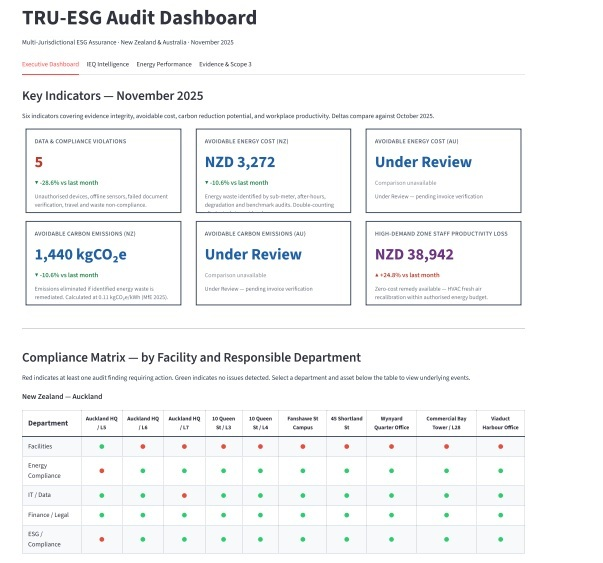

# TRU-ESG Audit Pipeline

**An automated assurance layer for multi-jurisdictional ESG disclosure — New Zealand & Australia**


🔗 **Live dashboard:** [tru-esg-audit-pipeline.streamlit.app](https://tru-esg-audit-pipeline.streamlit.app/)

---

## The Problem

ESG assurance is moving from voluntary reporting to regulated, audit-grade disclosure — yet the underlying data was never built to withstand that scrutiny. A number that cannot be traced to its source is, in assurance terms, unverified. And unverified disclosure is no longer merely a reputational risk; it is a legal and regulatory one.

**TRU-ESG is built for this gap.** It is an assurance layer, not a carbon calculator — sitting between raw IoT telemetry and boardroom disclosure, aligning source data to the standards that govern ESG reporting (NABERSNZ, NABERS, WELL, GHG Protocol, IPMVP) and surfacing the integrity failures and compliance gaps that conventional frameworks assume away.

---

## Why It Matters

- **Efficiency & traceability** — every asset and interval audited automatically; every figure traces back to a specific event, timestamp, and regulatory clause.
- **Prioritised decisions** — findings ranked by financial, regulatory, and reputational exposure; unverified evidence is withheld from disclosure rather than reported as a false number.
- **Recoverable value** — quantifies avoidable carbon and cost, plus the staff productivity protected by maintaining air quality in premium zones (per Allen et al., 2019, Harvard).

---

## How It Works

**Inputs** → sensor telemetry (IoT CO₂, temperature, HVAC, sub-meters); financial evidence (invoices, travel records); compliance documents (waste certificates); reference data (asset registry, climate benchmarks).

**Processing** → twelve scenarios evaluate the data across three problem classes — integrity, operational anomaly, compliance gap — each anchored to a named standard. Cascade logic suspends downstream analysis when upstream evidence cannot be trusted.

**Outputs** → a machine-readable star schema for BI and audit teams, and a four-page Streamlit dashboard (Executive · IEQ · Energy · Evidence & Scope 3).

---

## Dashboard
### Executive Dashboard


### IEQ Intelligence - Indoor Air Quality


### Energy Performance - Green Building Benchmark


---
## The Twelve Audit Scenarios

These scenarios focus on the built-environment dimension of ESG — energy, indoor environmental quality, and the Scope 2/3 emissions that flow from building operations. All twelve run across both jurisdictions; the engine applies the jurisdiction-appropriate standard automatically (e.g. NABERSNZ vs. NABERS). The architecture is domain-agnostic and extends to other ESG data domains.

**Data Integrity & Assurance**

| Scenario | Business Risk | Regulatory Anchor |
|---|---|---|
| Unauthorised Device | Rogue sensors inject false data; corrupts the audit baseline | ISA/IEC 62443-2-1 · ISO/IEC 27402:2023 |
| Invoice Integrity | Silent tampering renders disclosures legally unverifiable | ISO/IEC 27001:2022 · ISAE 3000 |
| Telemetry Gap | Data voids invalidate benchmarking and carbon calculations | IPMVP EVO 10000-1:2022 · ISO 50001:2018 |

**Energy Performance & Scope 2**

| Scenario | Business Risk | Regulatory Anchor |
|---|---|---|
| Sub-Meter Drift | Metering gaps distort energy accounting and carbon reporting | LEED v4.1 · ASHRAE 211-2018 |
| After-Hours HVAC | Idle systems inflate carbon footprint invisibly | ASHRAE Guideline 14-2023 |
| Equipment Degradation | Gradual inefficiency undetected by point-in-time audits | ISO 50001:2018 · ISO 50002-2:2025 |
| NABERSNZ Compliance | Energy overrun triggers mandatory re-rating; certification at risk | NABERSNZ Rules v1.2 · AS/NZS 3598.1:2014 |

**Indoor Environment Quality (Social)**

| Scenario | Business Risk | Regulatory Anchor |
|---|---|---|
| IEQ Greenwashing | CO₂ breaches contradict green certification claims | NZS 4303:1990 (MBIE) · LEED v5 O+M |
| High-Demand IEQ | Poor air quality undermines the productivity ROI of premium space | WELL v2 · Allen et al. 2019 (Harvard) |

**Scope 3 & Value Chain**

| Scenario | Business Risk | Regulatory Anchor |
|---|---|---|
| Invoice vs. Benchmark | Billed consumption deviates from expected intensity | NABERS FY2020 · IPMVP Option C · ISAE 3000 |
| Scope 3 Travel | Short-haul business class inflates Scope 3 emissions | GHG Protocol Scope 3 Cat.6

> **Note on IP:** This repository demonstrates the pipeline's architecture, standards alignment, and detection logic. Specific thresholds, coefficients, and scoring formulas have been generalised; full methodology is available for discussion in a technical or interview setting.

---

## Tech Stack

Python (Pandas, NumPy) · SQLAlchemy · PostgreSQL (Google Cloud SQL) with local CSV fallback · Streamlit · Altair · star-schema data model.

Frameworks: ISAE 3000 · GHG Protocol · IPMVP · NABERS / NABERSNZ · WELL v2.

---

## Getting Started

```bash
git clone https://github.com/TalullaLu/tru-esg-audit-pipeline.git
cd tru-esg-audit-pipeline
pip install -r requirements.txt

# Run the audit engines, then launch the dashboard
python facility_audit.py && python energy_audit.py && python compliance_audit.py && python Final_Table.py
streamlit run app.py
```

The repository ships with complete **synthetic data** (no real client information), so the full pipeline runs out of the box. Cloud database connection is optional, via a local `.env` file (not included).

---

## About

Built by **Talulla Lu** — Master of Business Analytics (University of Waikato, 2026), with 7 years of APAC experience across green building and environmental monitoring. TRU-ESG reflects a simple conviction: ESG is an **evidence problem, not a reporting problem**. The organisations that win the trust of investors and regulators will be those who can *prove* their numbers — not just publish them.

📧 talulla777@gmail.com

*Synthetic data throughout. Asset names, locations, and figures are illustrative.*
